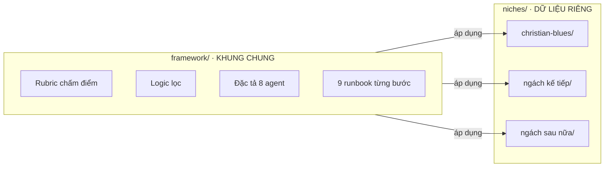
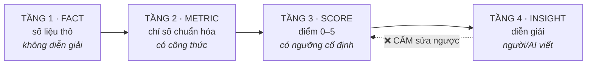
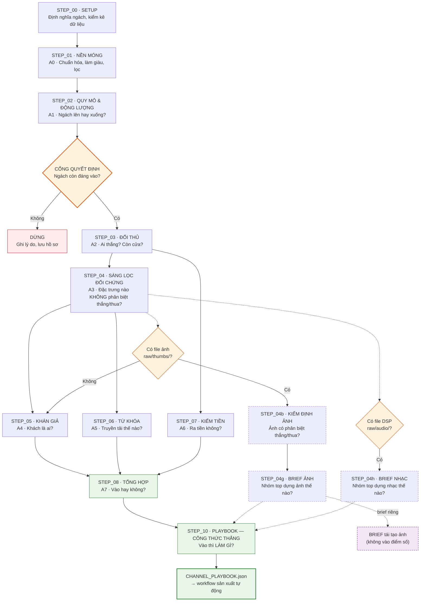
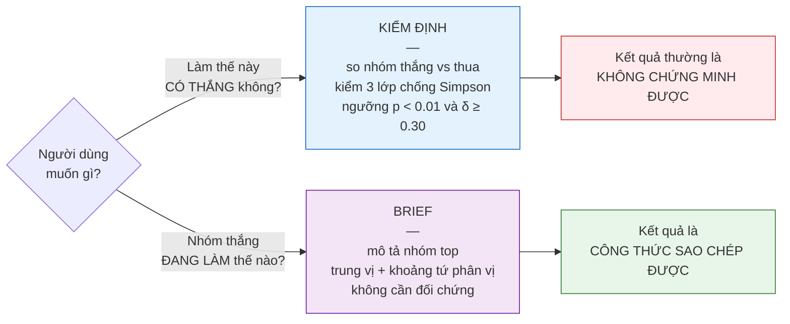
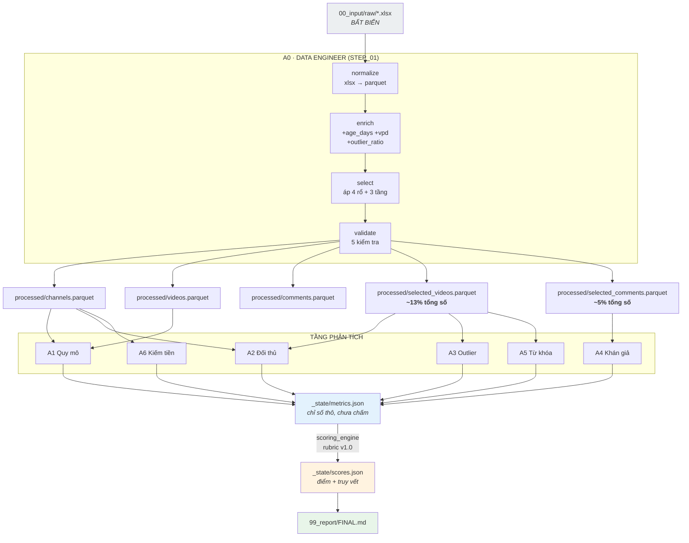
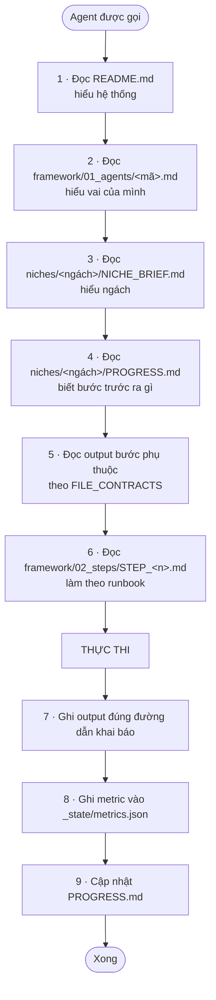
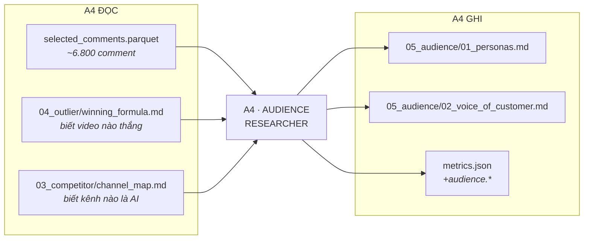
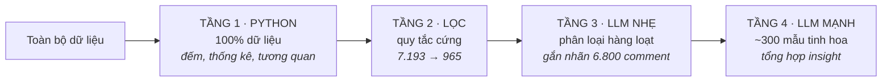
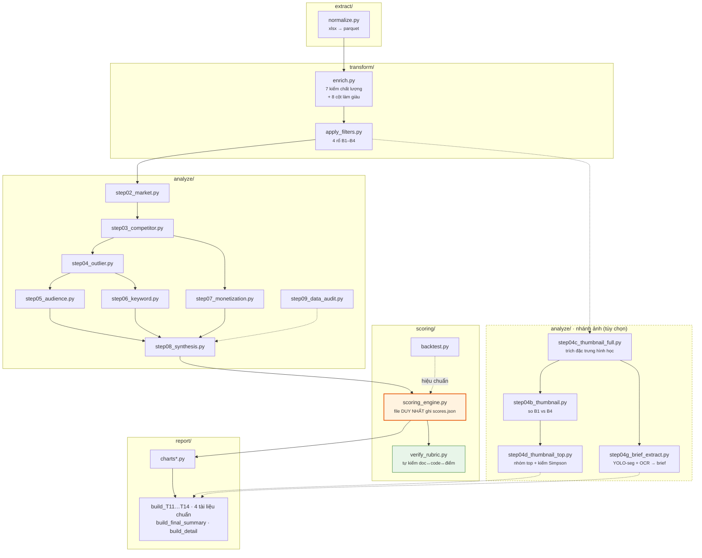
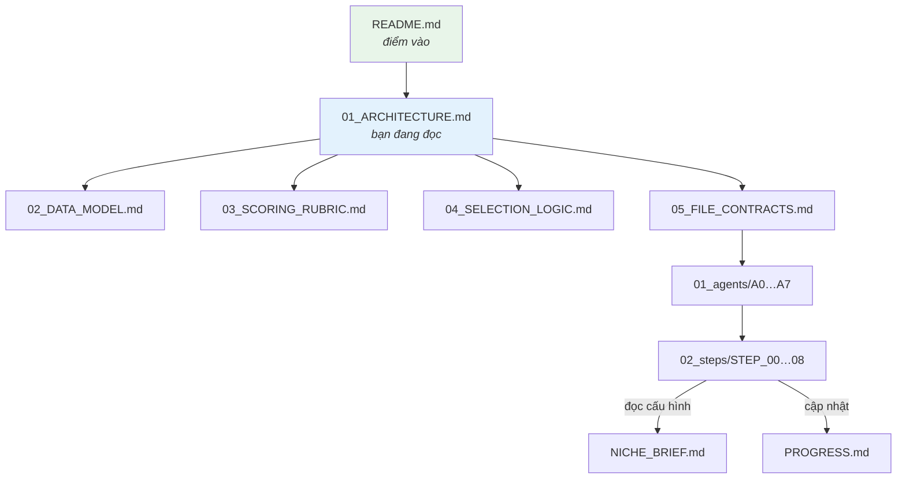

# KIẾN TRÚC HỆ THỐNG & WORKFLOW

> Tài liệu thiết kế tổng. Đọc file này trước khi chạy bất kỳ bước nào.
> Phiên bản: v2.0

---

## 1. TRIẾT LÝ THIẾT KẾ

### 1.1 Tách khung khỏi dữ liệu



**Hệ quả:** ngách thứ hai chỉ tốn công **thu thập dữ liệu + chạy quy trình**, không tốn công thiết kế lại. Và vì cùng rubric, hai ngách **so sánh được trực tiếp với nhau**.

### 1.2 Bốn tầng xử lý — không được trộn



Tầng 4 **không được** sửa tầng 3. Muốn đổi điểm → đổi *ngưỡng* ở tầng 3 → chạy lại toàn bộ.
Đây là điều bảng Excel thủ công không làm được, và là lý do nó không nhất quán.

---

## 2. WORKFLOW TỔNG — 10 BƯỚC



> **Nét đứt = nhánh tùy chọn.** STEP_04b/04g chỉ chạy khi có file ảnh, STEP_04h chỉ chạy khi
> có file DSP âm thanh. Cả hai **không tác động điểm số** — chúng trả lời câu hỏi khác (xem §2.4).

### 2.1 Vì sao có CỔNG QUYẾT ĐỊNH sau STEP_02

Đây là điểm khác biệt lớn nhất so với quy trình tuyến tính thông thường.

STEP_02 trả lời câu hỏi **sống còn**: *cầu có tăng nhanh hơn cung không?*
Nếu **không** → mọi phân tích sau (công thức thắng, chân dung khách hàng, từ khóa) đều là **tối ưu hóa một con tàu đang chìm**.

| Kết quả STEP_02 | Hành động |
|---|---|
| `M2.4 ≥ 1.0` — cầu ≥ cung | ✅ Đi tiếp bình thường |
| `M2.4` trong `[0.5, 1.0)` | ⚠️ Đi tiếp nhưng **đổi câu hỏi**: không hỏi "vào hay không" mà hỏi "vào bằng khác biệt gì" |
| `M2.4 < 0.5` | 🛑 Dừng, trừ khi có lý do chiến lược khác |

> **Ví dụ thật — và bài học:** khảo sát sơ bộ Christian Blues báo `M2.4 ≈ 0.35` → vùng "dừng".
> Nhưng con số đó **SAI**: nó so cửa sổ 0–90 ngày (chỉ 36% video đã chín) với cửa sổ 90–180 ngày
> (100% đã chín). Tính lại trên hai cửa sổ **đều chín** → **`M2.4 = 1.305`**, ngách khỏe.
> Cổng quyết định suýt loại nhầm một ngách tốt. Xem bẫy **L1** trong `lessons_learned.md`.

### 2.2 Vì sao STEP_05 và STEP_06 chạy sau STEP_04

Không phải thứ tự tùy tiện:

- **STEP_04 chọn ra video thắng** → STEP_05 chỉ đọc comment **của những video đó** (không phải toàn bộ 145k)
- **STEP_04 loại bỏ giả thuyết sai** → STEP_06 không phí công phân tích từ khóa theo hướng đã bị bác bỏ

Đảo thứ tự sẽ phải quét toàn bộ dữ liệu → vi phạm nguyên tắc chọn lọc.

> ⚠️ **STEP_04 KHÔNG "xác định công thức".** Nó chỉ **loại trừ** — kết quả điển hình
> 0/20 đặc trưng đứng vững. Công thức sản xuất là đầu ra của **STEP_10**, bước tổng hợp
> sau khi đã có 04b (thumbnail thật), 05 (khán giả), 06 (từ khóa).
>
> Đây từng là nguồn hiểu nhầm: bước tên *"Công thức thắng"* lại nằm **trước** mọi phân tích
> hợp thành công thức. Đã đổi tên thành **SÀNG LỌC ĐỐI CHỨNG** (bài học T29).

### 2.3 Nhánh song song

| Chạy song song được | Vì sao |
|---|---|
| STEP_05 ‖ STEP_06 | Cùng đọc output STEP_04, không phụ thuộc nhau |
| STEP_07 ‖ (STEP_04→06) | Chỉ cần output STEP_03 |
| STEP_04b/04g ‖ (STEP_05→07) | Nhánh ảnh độc lập, không tác động điểm số |
| STEP_04h ‖ (STEP_05→07) | Nhánh nhạc độc lập, chỉ cần `video_id` |

### 2.4 HAI LOẠI CÂU HỎI — quyết định phương pháp

> Bài học đắt nhất của dự án (2026-08-17). Cùng một bộ dữ liệu, hai câu hỏi khác nhau
> đòi hai phương pháp khác hẳn. Chọn nhầm thì làm đúng quy trình mà ra sai thứ người dùng cần.



| | KIỂM ĐỊNH (STEP_04b) | BRIEF (STEP_04g) |
|---|---|---|
| **Câu hỏi** | Đặc điểm X có gây ra thành công? | Nhóm thành công trông thế nào? |
| **Cần đối chứng?** | **Bắt buộc** (rổ B4) | Không |
| **Cần kiểm Simpson?** | **Bắt buộc** 3 lớp | Không |
| **Nguồn** | toàn bộ + rổ đối chứng | chỉ top 5% |
| **Đầu ra** | xác nhận / bác bỏ | trung vị + khoảng + prompt mẫu |
| **Bước áp dụng** | STEP_04, 04b | STEP_04g (ảnh), **STEP_04h (nhạc)** |
| **Kết quả điển hình** | 0/12 xác nhận | công thức dùng được ngay |
| **Dùng để** | quyết định vào ngách | sản xuất hàng loạt |

**Quy tắc:** hỏi người dùng cần **đầu ra** gì *trước khi* chọn phương pháp.
Nếu họ cần "tái tạo được" → làm brief. Nếu họ cần "có nên tin không" → làm kiểm định.
Hai cái **không thay thế nhau**, và brief **không được** trình bày như bằng chứng nhân quả.

---

## 3. WORKFLOW DỮ LIỆU — TỪ FILE THÔ ĐẾN BÁO CÁO



**Điểm mấu chốt:** `metrics.json` và `scores.json` **tách riêng**.
Agent phân tích chỉ ghi vào `metrics.json` (số thô). Chỉ `scoring_engine` mới ghi `scores.json`. Đây là cách thực thi quy tắc R2.

---

## 4. CÁCH AGENT ĐỌC FILE VÀ LIÊN KẾT THÔNG TIN

### 4.1 Nghi thức khởi động — mọi agent đều làm



**Bước 4 quan trọng nhất:** `PROGRESS.md` là **bộ nhớ chung**. Agent không đọc nó sẽ làm lại việc đã có, hoặc dùng giả định sai.

### 4.2 Ba cơ chế liên kết thông tin

| Cơ chế | Dùng khi | File |
|---|---|---|
| **Truyền qua file** | Bước sau cần output bước trước | `FILE_CONTRACTS.md` khai báo |
| **Sổ chỉ số chung** | Nhiều agent cùng góp số cho rubric | `_state/metrics.json` |
| **Nhật ký tiến độ** | Biết trạng thái toàn cục | `PROGRESS.md` |

### 4.3 Ví dụ liên kết thật — A4 Audience Researcher



A4 đọc output của A3 để biết **comment nào đáng đọc** — thay vì quét 145.150 comment.
Đây là cách "chọn lọc" được thực thi ở cấp workflow, không chỉ ở cấp lọc dữ liệu.

---

## 5. TÁM AGENT — BẢNG TỔNG

| Mã | Tên | Step | Đọc | Ghi |
|---|---|---|---|---|
| **A0** | Data Engineer | 01 | `raw/*` | `processed/*.parquet` |
| **A1** | Market Analyst | 02 | `channels`, `videos` | `02_market/` |
| **A2** | Competitor Analyst | 03 | `channels`, `selected_videos` | `03_competitor/` |
| **A3** | Outlier Miner | 04 | `selected_videos`, `thumbnails` | `04_outlier/` |
| **A4** | Audience Researcher | 05 | `selected_comments`, A3 output | `05_audience/` |
| **A5** | Keyword Analyst | 06 | `selected_videos`, A3 output | `06_keyword/` |
| **A6** | Monetization Analyst | 07 | `channels`, A2 output | `07_monetization/` |
| **A7** | Synthesizer | 08 | tất cả + `scores.json` | `99_report/` |

Chi tiết từng agent: `framework/01_agents/`

---

## 6. NGUYÊN TẮC PHÂN TÍCH DỮ LIỆU

### 6.1 Phân tầng công cụ — tiết kiệm chi phí



**Quy tắc:** thống kê mô tả **không bao giờ** dùng LLM. Chỉ dùng LLM cho việc *hiểu ngôn ngữ*.

### 6.2 Sáu quy tắc phân tích bắt buộc

| # | Quy tắc | Chống lỗi gì |
|---|---|---|
| D1 | Dùng **trung vị**, không dùng trung bình | View phân bố đuôi dài |
| D2 | **Chuẩn hóa theo chính kênh** trước khi so sánh | Kênh to video nào cũng nhiều view |
| D3 | Chuẩn hóa theo **tuổi video** (`vpd`) | Video cũ tích view lâu hơn |
| D4 | Luôn có **nhóm đối chứng** | Survivorship bias |
| D5 | Ghi **giả thuyết trước** khi chạy | Confirmation bias |
| D6 | Báo cáo cả **bằng chứng phản bác** | Thiên lệch xác nhận |

### 6.3 Ba câu hỏi phải trả lời trước mọi kết luận

1. **So với cái gì?** — Không có mốc so sánh thì con số vô nghĩa
2. **Có thể do nguyên nhân khác không?** — Liệt kê ít nhất một cách giải thích ngược
3. **Độ tin cậy bao nhiêu?** — cao / vừa / thấp, kèm lý do

---

## 7. QUẢN LÝ TRẠNG THÁI

### 7.1 `PROGRESS.md` — bộ nhớ chung

Mỗi bước xong phải cập nhật. Định dạng cố định:

```markdown
## STEP_02 · Quy mô & động lượng
- Trạng thái: ✅ XONG | 🔄 ĐANG CHẠY | ⬜ CHƯA | 🛑 CHẶN
- Chạy lúc: 2026-08-15
- Output: 02_market/01_market_sizing.md
- Phát hiện chính: M2.4 = 0.35 → cảnh báo pha loãng
- Độ tin cậy: Vừa (chỉ 1 snapshot)
- Cảnh báo cho bước sau: cần tách kênh rác khỏi kênh tốt
```

### 7.2 `_state/metrics.json` — sổ chỉ số

Mọi agent **thêm** vào, không ghi đè phần của agent khác:

```json
{
  "niche": "christian-blues",
  "market":     { "M1_1_views_month": 10573212, "...": "..." },
  "momentum":   { "M2_4_demand_supply_gap": 0.35 },
  "entry":      { "M3_2_newcomer_success_rate": null },
  "_meta": {
    "M2_4_demand_supply_gap": {
      "source": "processed/videos.parquet",
      "computed_by": "A1",
      "computed_at": "2026-08-15",
      "confidence": "medium",
      "caveat": "chỉ 1 snapshot, suy từ published_at"
    }
  }
}
```

Trường `_meta` là bắt buộc — thực thi quy tắc R3 và R5.

---

## 8. PIPELINE CODE — SCRIPT NÀO CHẠY LÚC NÀO

> Mục §2 mô tả *khái niệm* các bước. Mục này map sang **file thật** để chạy.



### 8.1 Chạy toàn bộ bằng một lệnh

```bash
bash pipeline/run_all.sh                          # nhánh lõi + PDF   (~50 giây)
bash pipeline/run_all.sh --with-thumbs            # thêm nhánh ảnh    (~15 phút)
bash pipeline/run_all.sh niches/<ngách> --no-pdf  # ngách khác, bỏ PDF
```

### 8.2 Quy ước đặt tên

| Tiền tố | Nghĩa |
|---|---|
| `stepNN_` | tương ứng STEP_NN trong `02_steps/` |
| `stepNNx_` | nhánh phụ của STEP_NN (`04b`, `04c`, `04d`, `04g`) |
| `build_T1N_*.py` | sinh một trong **bốn tài liệu chuẩn** T1.1–T1.4 (xem `11_OUTPUT_CONTRACT.md`) |
| `build_reportNN.py` | ⚠️ **quy ước cũ** — 7 file theo STEP đã chuyển vào `_archive/report_by_step/` (2026-08-28) |
| `chartsNN.py` | vẽ biểu đồ cho STEP_NN, chạy **trước** `build_report` |
| `_archive/` | script đã loại bỏ, **không** thuộc pipeline |

### 8.3 Ba bất biến của code

| # | Bất biến | Vì sao |
|---|---|---|
| 1 | **Chỉ `scoring_engine.py` được ghi `scores.json`** | Chống "tự chấm tự khen" (quy tắc R2) |
| 2 | **Script phân tích không sửa `00_input/raw/`** | Nguồn sự thật bất biến (R1) |
| 3 | **Mọi script nhận `niche_path` làm tham số 1** | Chạy được cho ngách bất kỳ |

---

## 9. SƠ ĐỒ QUAN HỆ TÀI LIỆU



| Đọc khi | File |
|---|---|
| Lần đầu tiếp cận hệ thống | `README.md` → file này |
| Cần hiểu schema dữ liệu | `02_DATA_MODEL.md` |
| Cần hiểu cách chấm điểm | `03_SCORING_RUBRIC.md` |
| Cần biết agent đọc/ghi gì | `05_FILE_CONTRACTS.md` |
| **Bốn tài liệu đầu ra T1.1–T1.4** | **`11_OUTPUT_CONTRACT.md`** |
| **Sáu nhóm nguồn Y·P·S·V·K·N** | **`10_SOURCE_CLASSES.md`** |
| Sắp chạy một bước | `02_steps/STEP_<n>.md` |
| Muốn biết đang ở đâu | `niches/<ngách>/PROGRESS.md` |

---

## 10. HỆ THỐNG NÀY KHÔNG LÀM GÌ

Nói rõ giới hạn để không kỳ vọng sai:

| Không làm | Vì sao |
|---|---|
| Không tự crawl dữ liệu | Crawl là khâu riêng, hệ thống này bắt đầu từ dữ liệu đã có |
| Không dự đoán view tương lai | Chỉ đo trạng thái hiện tại và xu hướng đã xảy ra |
| Không thay quyết định kinh doanh | Đưa bằng chứng có cấu trúc, người quyết |
| Không phân tích được thứ dữ liệu không có | Ví dụ: retention, CTR, traffic source — YouTube API không trả về cho kênh người khác |
