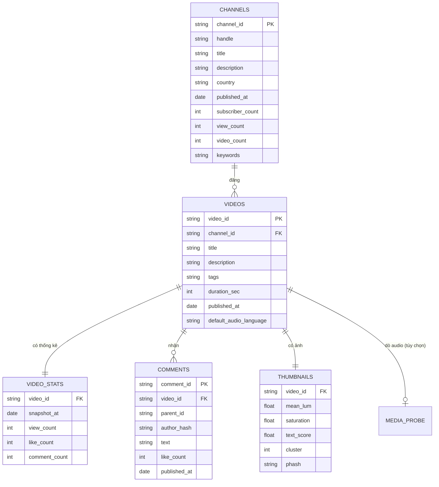

# MÔ HÌNH DỮ LIỆU

> Schema chuẩn mà hệ thống mong đợi. Dữ liệu crawl của ngách mới phải khớp mô hình này,
> hoặc phải viết bộ chuyển đổi trong `A0` trước khi chạy tiếp.
>
> Phiên bản: v1.1 · Cập nhật 2026-08-28 · thêm trường `source_class`

---

## 1. SƠ ĐỒ QUAN HỆ



---

## 2. BẢNG BẮT BUỘC vs TÙY CHỌN

| Bảng | Bắt buộc? | Không có thì mất gì |
|---|---|---|
| `channels` | ✅ **Bắt buộc** | Không chạy được gì |
| `videos` | ✅ **Bắt buộc** | Không chạy được gì |
| `video_stats` | ✅ **Bắt buộc** | Không có view → vô nghĩa |
| `comments` | 🟡 Rất nên có | **Mất toàn bộ STEP_05** (chân dung khách hàng) |
| `thumbnails` | 🟡 Nên có | STEP_04 mất phần phân tích ảnh |
| `media_probe` | ⬜ Tùy chọn | Mất phân tích nhạc lý |

> **Bài học từ Christian Blues:** `media_probe` chỉ có 40/7.193 mẫu (0.6%) → không kết luận được gì.
> Quy tắc: một bảng phải phủ **≥ 30% số video** mới đủ để rút kết luận.

---

## 3. CỘT LÀM GIÀU — A0 TÍNH THÊM

Không có sẵn trong dữ liệu crawl, `A0` phải tính:

| Cột | Công thức | Vì sao cần |
|---|---|---|
| `age_days` | `crawl_date − published_at`, tối thiểu 1 | Chuẩn hóa theo tuổi |
| `vpd` | `view_count / age_days` | So sánh video khác tuổi |
| `channel_median_view` | trung vị view theo `channel_id` | Mốc so sánh nội bộ kênh |
| `outlier_ratio` | `view_count / channel_median_view` | Đo độ "nổ" thật |
| `engagement_rate` | `(like + comment) / view_count` | Chất lượng tương tác |
| `duration_band` | phân nhóm `duration_sec` | So sánh theo định dạng |
| `channel_age_months` | `(crawl_date − channel.published_at) / 30.44` | Đo độ trẻ của kênh |
| `is_matured` | `age_days ≥ 60` | Chỉ video chín mới đo được hiệu quả thật |

### Phân nhóm `duration_band` chuẩn

| Nhãn | Điều kiện |
|---|---|
| `Shorts` | `< 60s` |
| `1-6m` | `60s – 6m` |
| `6-30m` | `6m – 30m` |
| `30-60m` | `30m – 60m` |
| `1-3h` | `1h – 3h` |
| `3h+` | `> 3h` |

---

## 4. CỘT `_matured` — QUY TẮC QUAN TRỌNG

**Không bao giờ so sánh hiệu quả bằng video mới đăng.**

Video đăng 5 ngày trước chưa kịp tích view. Đưa vào so sánh sẽ kéo trung vị xuống, tạo ảo giác "thị trường đang sụp".

```
Phân tích hiệu quả (view trung vị, outlier)  → CHỈ dùng is_matured = True
Phân tích nguồn cung (số video/tháng)        → dùng TOÀN BỘ
```

> Đây chính là lỗi dễ mắc nhất khi đo "pha loãng thị trường".

---

## 5. KIỂM TOÁN CHẤT LƯỢNG BẮT BUỘC

`A0` phải sinh `DATA_QUALITY.md` với bảng sau:

| Kiểm tra | Ngưỡng đạt | Không đạt thì sao |
|---|---|---|
| Tỷ lệ null từng cột | < 30% | Ghi rõ, cấm dùng cột đó làm kết luận chính |
| Trùng `video_id` | = 0 | Khử trùng, ghi số lượng |
| `view_count` âm hoặc null | = 0 | Loại khỏi phân tích |
| `published_at` tương lai | = 0 | Lỗi timezone — sửa |
| Số snapshot trong `video_stats` | ≥ 2 | **1 snapshot → hạ độ tin cậy trục Động lượng xuống "vừa"** |
| Phủ `comments` | ≥ 30% video | Dưới ngưỡng → cảnh báo ở STEP_05 |
| Phủ `thumbnails` | ≥ 30% video | Dưới ngưỡng → bỏ phần phân tích ảnh |

---

## 6. HIỆN TRẠNG — CHRISTIAN BLUES

Kết quả kiểm toán trên dữ liệu thật:

| Bảng | Dòng | Đánh giá | Ghi chú |
|---|---|---|---|
| `channels` | 53 | 🟢 Tốt | `country` thiếu 8 |
| `videos` | 7.193 | 🟡 Khá | `tags` thiếu 23%, `language` thiếu 39% |
| `video_stats` | 7.193 | 🟡 Khá | **Chỉ 1 snapshot** → hạ tin cậy trục T2 |
| `comments` | 145.150 | 🟢 Rất tốt | Phủ 5.330/7.193 video = 74% |
| `thumbnails` | 7.193 | 🟢 Tốt | Phủ 100%, có sẵn 22 đặc trưng |
| `media_probe` | 40 | 🔴 Không đủ | Phủ 0.6% → **không dùng để kết luận** |
| `crawl_jobs` | 5.490 | 🟢 | Nhật ký, dùng kiểm tra video bị bỏ sót |

**Hai việc nên làm để nâng chất lượng:**
1. Chạy `snapshot` thêm 1–2 lần cách nhau 7–14 ngày → nâng trục Động lượng từ "vừa" lên "cao"
2. Mở rộng `media_probe` lên ≥ 2.000 mẫu nếu muốn phân tích nhạc lý

---

## TRƯỜNG `source_class` TRONG `_meta`

Từ 2026-08-28, mọi chỉ số trong `_state/metrics.json` mang thêm một trường khai
**nhóm nguồn dữ liệu** sinh ra nó.

| Mã | Nhóm nguồn | Quan sát được cái gì |
|---|---|---|
| `Y` | YouTube | Cung đã tồn tại và đang thắng |
| `P` | Nền tảng khác (Spotify, podcast, TikTok) | Cung thay thế |
| `S` | Tín hiệu tìm kiếm (Trends, autocomplete) | Cầu qua hành vi |
| `V` | Tiếng nói người dùng (Reddit, forum) | Cầu phát ngôn, ngôn ngữ thật |
| `K` | Khoa học & báo cáo ngành | Cơ chế công năng |
| `N` | Nội bộ HG Media / FMG | RPM thật, Analytics kênh nhà |

Ghép nhiều nguồn dùng dấu `+`, ví dụ `"Y+K"` cho chỉ số RPM (dung lượng đo từ
YouTube, đơn giá lấy từ benchmark ngoài).

```json
"_meta": {
  "M2_4_demand_supply_gap": {
    "source": "processed/videos.parquet",
    "source_class": "Y",
    "computed_by": "A1",
    "confidence": "medium"
  }
}
```

**Ai gắn:** `pipeline/transform/collect_metrics.py` gắn tự động theo nhóm chỉ số
(`SOURCE_CLASS_BY_GROUP`). Đây là nơi **duy nhất** mọi chỉ số đi qua, nên không
bắt 6 script phân tích tự nhớ.

**Vì sao cần:** YouTube trả lời *đầy đủ* câu "ai đang thắng" nhưng *rất kém* câu
"cầu nào chưa được đáp ứng" và *gần như mù* câu "cầu dịch chuyển về đâu". Không
gắn mã thì ba loại phát biểu đó trông giống hệt nhau trong báo cáo.

Chi tiết: `10_SOURCE_CLASSES.md`
