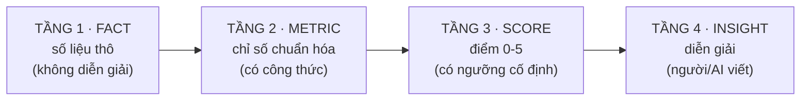

# CƠ CHẾ CHẤM ĐIỂM — Rubric v1.0

> Tài liệu này định nghĩa **chính xác** cách một ngách được chấm điểm.
> Mục tiêu: **hai người khác nhau chấm cùng một dữ liệu phải ra cùng một điểm.**
>
> **Đây là tài liệu KHUNG CHUNG** — áp dụng cho mọi ngách, không sửa riêng cho ngách nào.
> Muốn đổi ngưỡng → đổi ở đây → chạy lại **tất cả** ngách đã chấm (quy tắc R7).
>
> Phiên bản: v1.0 · Cập nhật 2026-08-15 · rubric 20 điểm

---

## 0. RUBRIC LÀ GÌ? (đọc phần này trước)

### 0.1. Định nghĩa

**Rubric = bảng tiêu chí chấm điểm có ngưỡng cố định.**

Giống như barem chấm thi: không phải "bài này hay thì cho 8 điểm", mà là *"đúng ý A được 2 điểm,
đúng ý B được 3 điểm, trình bày sạch được 1 điểm"*. Ai chấm cũng ra cùng kết quả.

Trong dự án này, rubric trả lời câu hỏi:

> **Ngách YouTube này đáng đầu tư đến mức nào, trên thang 0–20?**

### 0.2. Vì sao cần rubric thay vì chấm cảm tính

Đây là ví dụ **có thật** từ bảng chấm thủ công ban đầu:

| Dòng nhạc | Top 20% kênh chiếm | Điểm được chấm |
|---|---|---|
| Reggaeton | 57,6% | **5** |
| R&B | 60,4% | **4** |
| Soul Funk | 60,7% | **3** |
| Christian Blues | 61,8% | **2** |

Bốn con số gần như bằng nhau (57–62%), nhưng nhận **bốn mức điểm khác nhau** — chênh nhau
tới 3 điểm. Đây không phải lỗi của người chấm; đây là điều **tất yếu xảy ra** khi không có
ngưỡng viết sẵn.

Với rubric, cả bốn đều rơi vào khoảng `55–62% → 4 điểm`, nên **cùng được 4 điểm**.

### 0.3. Rubric gồm ba thành phần

```
1. TRỤC     — chấm những khía cạnh nào?        (6 trục: T1…T6)
2. NGƯỠNG   — số bao nhiêu thì được mấy điểm?  (bảng tra cứu cố định)
3. TRỌNG SỐ — trục nào quan trọng hơn?         (%, cộng lại = 100%)
```

Ví dụ trục T1 (Quy mô):

| Thành phần | Nội dung |
|---|---|
| **Trục** | Quy mô thị trường — ngách có đủ lớn để nuôi kênh không? |
| **Đo bằng** | `M1.1` = tổng views/tháng của ngách |
| **Ngưỡng** | ≥50tr→5đ · 20–50tr→4đ · 8–20tr→3đ · 3–8tr→2đ · 1–3tr→1đ · <1tr→0đ |
| **Trọng số** | 20% |

Ngách Christian Blues có 7,45tr views/tháng → rơi vào khoảng `3–8tr` → **2 điểm**.
Không tranh cãi được, vì ngưỡng đã viết sẵn từ trước.

### 0.4. Cách tính điểm tổng

```
SCORE = (T1×20% + T2×25% + T3×25% + T4×15% + T5×10%) × 4 − T6_penalty
```

Nhân 4 để đưa thang 0–5 về thang 0–20. T6 (rủi ro) là điểm **trừ**, không phải điểm cộng.

Ví dụ thật với ngách Christian Blues:

| Trục | Điểm | Trọng số | Đóng góp |
|---|---|---|---|
| T1 Quy mô | 2,0 | 20% | 1,60 |
| T2 Động lượng | 4,0 | 25% | 4,00 |
| T3 Cửa gia nhập | 4,25 | 25% | 4,25 |
| T4 Phù hợp AI | 5,0 | 15% | 3,00 |
| T5 Kiếm tiền | 3,0 | 10% | 1,20 |
| T6 Rủi ro | −2 | — | −2,00 |
| | | | **= 12,05 / 20** |

> ⚠️ T3 từng là **4,4** (tổng 12,20). Sai vì M3.3 *"KHÔNG ĐO ĐƯỢC"* vẫn được chấm 5/5.
> Nay chia lại trọng số cho phần đo được → **4,25** (tổng **12,05**). Xem §4·T3 và bài học T25.

### 0.5. Ba nguyên tắc bất di bất dịch

| # | Nguyên tắc | Vì sao |
|---|---|---|
| **1** | **Ngưỡng viết TRƯỚC khi nhìn dữ liệu** | Nhìn dữ liệu rồi mới đặt ngưỡng = tự chứng minh điều mình muốn tin |
| **2** | **Muốn đổi điểm thì đổi NGƯỠNG, rồi chạy lại TẤT CẢ ngách** | Nếu sửa điểm lẻ cho một ngách, các ngách không còn so sánh được với nhau |
| **3** | **Mọi điểm phải truy vết được** về công thức → ngưỡng → bằng chứng → nguồn → độ tin cậy | Để 6 tháng sau vẫn biết vì sao ra con số đó |

### 0.6. Rubric KHÔNG làm được gì

Nói rõ giới hạn để không kỳ vọng sai:

- **Không thay quyết định kinh doanh.** Nó cho điểm có căn cứ, người quyết vẫn là bạn.
- **Không chính xác tuyệt đối.** Trục T5 (kiếm tiền) dựa trên RPM ước tính — độ tin cậy Thấp.
- **Không dự đoán tương lai.** Nó đo trạng thái hiện tại và xu hướng đã xảy ra.
- **Điểm cao không đảm bảo thành công**, điểm thấp không đảm bảo thất bại. Nó chỉ nói
  *xác suất và mức độ thuận lợi*.

### 0.7. Đọc tiếp phần nào

| Bạn muốn biết | Đọc mục |
|---|---|
| Vì sao cần rubric (chi tiết hơn) | §1 |
| Cấu trúc 4 tầng Fact→Metric→Score→Insight | §2 |
| Sáu trục là gì, trọng số bao nhiêu | §3 |
| Công thức và ngưỡng chính xác từng trục | §4 |
| Cách tính tổng và diễn giải điểm | §5 |
| Định dạng file truy vết | §6 |
| Cách kiểm rubric có đúng không (backtest) | §7 |

---

## 1. VẤN ĐỀ CỦA CÁCH CHẤM CŨ

Từ file `FMG_phan-tich-dong-nhac.csv`, tôi tìm được các lỗi hệ thống:

> Các ví dụ dưới đây lấy từ một bảng chấm thủ công có thật, giữ lại vì chúng minh họa
> **lỗi hệ thống mà mọi bảng chấm tay đều mắc** — không riêng gì bảng đó.

| Lỗi | Bằng chứng cụ thể | Hậu quả |
|---|---|---|
| **L1 · Không nhất quán** | Top20% = 61.80% → 2đ (Christian Blues)<br>Top20% = 60.69% → 3đ (Soul Funk)<br>Top20% = 60.41% → 4đ (R&B) | 3 số gần bằng nhau, 3 điểm khác nhau |
| **L2 · Không có ngưỡng** | Không định nghĩa "Rất lớn" là bao nhiêu view | Chấm theo cảm giác |
| **L3 · Thang phi tuyến ẩn** | Country 10.57tr → 1đ<br>Christian Blues 10.57tr → 3đ<br>Blues Soul 6.26tr → 3đ | Cùng số view, khác điểm |
| **L4 · Nhãn sai** | Christian Blues: Top20%=61.8% nhưng ghi "Mức độ phân hóa: **Cao**" | 61.8% là THẤP (mở), không phải cao |
| **L5 · Trộn tầng** | Cột "Nhận định" vừa mô tả dữ kiện vừa kết luận | Không truy vết được |
| **L6 · Bỏ sót trục** | Không có trục kiếm tiền, không có trục rủi ro | Series tên "kiếm tiền" nhưng không đo tiền |

**→ Giải pháp: rubric có công thức, có ngưỡng, tự động tính.**

---

## 2. KIẾN TRÚC CHẤM ĐIỂM 4 TẦNG



**Quy tắc bất di bất dịch:** Tầng 4 KHÔNG được sửa tầng 3. Nếu thấy điểm sai → sửa **ngưỡng ở tầng 3**, rồi chạy lại toàn bộ. Điều này đảm bảo mọi ngách luôn được chấm bằng cùng một thước.

---

## 3. SÁU TRỤC CHẤM ĐIỂM

Mở rộng từ 4 trục của bạn, thêm 2 trục còn thiếu:

| Trục | Trọng số | Có trong bảng cũ? | Đo cái gì |
|---|---|---|---|
| **T1 · Quy mô thị trường** | 20% | ✅ | Ngách đủ lớn để nuôi kênh không |
| **T2 · Động lượng tăng trưởng** | 25% | ❌ **MỚI** | Đang lên hay đang xuống |
| **T3 · Cửa gia nhập** | 25% | ✅ (sai công thức) | Người mới còn cửa không |
| **T4 · Phù hợp sản xuất AI** | 15% | ✅ | Mô hình AI-first làm được không |
| **T5 · Giá trị kiếm tiền** | 10% | ❌ **MỚI** | 1 triệu view ra bao nhiêu tiền |
| **T6 · Rủi ro** | 5% (trừ điểm) | ❌ **MỚI** | Policy, bão hòa, phụ thuộc |

> **Vì sao T2 nặng nhất (25%):** Christian Blues chứng minh điều này — quy mô chỉ trung bình nhưng tăng 3tr→10tr view/tháng. Động lượng dự báo tương lai tốt hơn quy mô hiện tại.
>
> **Vì sao T3 = 25%:** Ngách lớn mà bị khóa (như Christian/Gospel gốc: top20% = 81.98%) thì vô dụng với người mới.

---

## 4. CÔNG THỨC & NGƯỠNG TỪNG TRỤC

### T1 · QUY MÔ THỊ TRƯỜNG (20%)

**Metric:**
```
M1.1 = tổng views/tháng của ngách
M1.2 = số kênh hoạt động (≥1 video/90 ngày)
M1.3 = median view/video   ← dùng MEDIAN, không dùng MEAN (README cảnh báo đuôi dài)
```

**Ngưỡng (thang log — vì view phân bố log-normal):**

| Điểm | Views/tháng |
|---|---|
| 5 | ≥ 50tr |
| 4 | 20tr – 50tr |
| 3 | 8tr – 20tr |
| 2 | 3tr – 8tr |
| 1 | 1tr – 3tr |
| 0 | < 1tr |

> Ngưỡng theo bậc ~2.5× thay vì tuyến tính. Sửa lỗi **L3**: giờ Country và Christian Blues cùng 10.57tr → **cùng 3 điểm**.

---

### T2 · ĐỘNG LƯỢNG TĂNG TRƯỞNG (25%) — TRỤC MỚI

**Metric:**
```
M2.1 = view_growth  = views 3 tháng gần / views 3 tháng trước đó
M2.2 = supply_growth = số video mới 3 tháng gần / 3 tháng trước
M2.3 = new_channel_rate = % kênh < 12 tháng tuổi
M2.4 = demand_supply_gap = M2.1 / M2.2      ← CHỈ SỐ QUAN TRỌNG NHẤT
```

**M2.4 giải thích:**
- `> 1.2` → **cầu tăng nhanh hơn cung** = cơ hội vàng
- `≈ 1.0` → cân bằng
- `< 0.8` → **cung tăng nhanh hơn cầu** = đang bão hòa, view/video sẽ giảm

| Điểm | Điều kiện |
|---|---|
| 5 | M2.1 ≥ 2.0 **và** M2.4 ≥ 1.2 |
| 4 | M2.1 ≥ 1.5 **và** M2.4 ≥ 1.0 |
| 3 | M2.1 ≥ 1.2 |
| 2 | M2.1 ≥ 0.9 (đi ngang) |
| 1 | M2.1 ≥ 0.7 (giảm nhẹ) |
| 0 | M2.1 < 0.7 (sụp) |

> Trục này bắt được cái mà bảng cũ ghi trong ô nhận xét ("tăng từ 3tr → 10tr") nhưng **không đưa vào điểm số**.

---

### T3 · CỬA GIA NHẬP (25%) — SỬA CÔNG THỨC

**Vấn đề cũ:** dùng "tỷ trọng view top 20%" nhưng chấm không nhất quán (lỗi L1).

**Metric mới — 3 thành phần:**

```
M3.1 = Gini coefficient của phân bố view theo kênh   (0=đều, 1=độc quyền)
M3.2 = newcomer_success_rate
     = % kênh < 12 tháng đạt ≥ 100k view/tháng
M3.3 = time_to_traction
     = số tháng trung vị để kênh mới đạt 100k view tích lũy
```

**Công thức điểm:**
```
T3_raw = 0.3 × score(M3.1) + 0.5 × score(M3.2) + 0.2 × score(M3.3)
```

| Điểm | M3.2 (newcomer success) | M3.1 (Gini) |
|---|---|---|
| 5 | ≥ 40% | ≤ 0.45 |
| 4 | 25–40% | 0.45–0.55 |
| 3 | 15–25% | 0.55–0.65 |
| 2 | 8–15% | 0.65–0.75 |
| 1 | 3–8% | 0.75–0.85 |
| 0 | < 3% | > 0.85 |

> **M3.2 có trọng số cao nhất (0.5)** vì đây là bằng chứng trực tiếp: người mới có thắng được không. Gini chỉ là gián tiếp.
>
> Sửa lỗi **L4**: hệ thống tự tính Gini từ dữ liệu, không gõ nhãn tay.

---

### T4 · PHÙ HỢP SẢN XUẤT AI (15%)

**Metric:**
```
M4.1 = ai_channel_ratio     = % kênh top 20 là AI-first (không phải nghệ sĩ thật)
M4.2 = audience_ai_tolerance = từ khảo sát Wavelength theo genre
M4.3 = production_complexity = instrumental(cao) / vocal đơn giản(vừa) / vocal cảm xúc(thấp)
M4.4 = format_scalability    = % video dạng long-mix/lyric (dễ nhân bản)
```

| Điểm | Điều kiện |
|---|---|
| 5 | M4.1 ≥ 60% và M4.2 = Cao |
| 4 | M4.1 ≥ 40% và M4.2 ≥ Khá |
| 3 | M4.1 ≥ 25% |
| 2 | M4.1 ≥ 10% |
| 1 | M4.1 ≥ 3% |
| 0 | Ngách do nghệ sĩ thật thống trị |

> **M4.1 là bằng chứng thực nghiệm** — thay cho việc đoán "AI làm được không". Nếu 60% kênh top đã là AI-first và đang thắng → chứng minh xong.
>
> **M4.2** lấy từ khảo sát thái độ khán giả theo genre (nguồn: Wavelength n=14.000, lưu ở
> `framework/04_reference/ai_tolerance_by_genre.md`). Đây là yếu tố dễ bị bỏ sót:
> cùng một mức độ "AI làm được", nhưng genre mà khán giả **phản đối AI** sẽ khó hơn nhiều.

---

### T5 · GIÁ TRỊ KIẾM TIỀN (10%) — TRỤC MỚI

**Metric:**
```
M5.1 = geo_mix       = % view từ Tier-1 (US/UK/CA/AU/NZ)
M5.2 = est_rpm       = RPM ước tính theo genre + geo + độ tuổi khán giả
M5.3 = watch_duration= độ dài trung vị (dài hơn = nhiều ad slot hơn)
M5.4 = revenue_per_1k_view = M5.2 điều chỉnh theo M5.3
```

| Điểm | RPM ước tính |
|---|---|
| 5 | ≥ $8 |
| 4 | $5 – $8 |
| 3 | $3 – $5 |
| 2 | $1.5 – $3 |
| 1 | $0.7 – $1.5 |
| 0 | < $0.7 |

> RPM phụ thuộc mạnh vào **geo + độ tuổi khán giả + chủ đề**. Bảng tham chiếu:
> `framework/04_reference/rpm_benchmarks.md`. Luôn verify ở STEP_07, không đoán.

**RPM ghi dạng KHOẢNG, chấm theo giá trị GIỮA.** Vì RPM không đo trực tiếp được,
`M5.2` lưu `[thấp, giữa, cao]` và bộ chấm lấy phần tử giữa — thận trọng, không lấy cận trên.

> Ví dụ Christian Blues: `[1.5, 3.0, 6.0]` → chấm theo **3,0** → rơi đúng ranh giới
> khoảng `$3–5` → **3 điểm**. Nếu lấy cận trên 6,0 thì thành 4 điểm — nên quy ước
> "lấy giữa" phải cố định, không chọn tùy lúc.

---

### T6 · RỦI RO (trừ tối đa 5 điểm)

| Rủi ro | Trừ | Metric | Ngưỡng kích hoạt |
|---|---|---|---|
| Reused content / AI bị soi | −2 | `risk.cross_title_pct` | **≥ 5%** video trùng tiêu đề giữa các kênh |
| Bản quyền (cover thánh ca) | −1 | `risk.copyright_flag` | cờ bật (true) |
| Phụ thuộc 1 kênh dẫn đầu | −1 | `entry.top1_share` | **> 40%** view ngách thuộc 1 kênh |
| Cung tăng vượt cầu | −1 | `momentum.M2.4` | **< 0,8** |

Điểm trừ **cộng dồn**, chặn ở tối đa −5.

> Ví dụ Christian Blues: `cross_title_pct` = 6,3% ≥ 5 → **−2**. Ba rủi ro còn lại
> không kích hoạt (`top1_share` = 18,5% ≤ 40%; M2.4 = 1,305 ≥ 0,8). Tổng **T6 = −2**.

---

## 5. TỔNG ĐIỂM

```
SCORE = (T1×0.20 + T2×0.25 + T3×0.25 + T4×0.15 + T5×0.10) × 20 / 5 − T6_penalty
```
→ Thang **0–20** (giữ cho tương thích với bảng cũ của bạn).

### Diễn giải

| Điểm | Kết luận |
|---|---|
| 16–20 | **Ưu tiên cao** — vào ngay |
| 13–15.9 | **Tiềm năng** — vào có điều kiện, cần khác biệt hóa |
| 10–12.9 | **Theo dõi** — chưa vào, quan sát thêm |
| < 10 | **Bỏ qua** |

---

## 6. BẢNG TRUY VẾT (bắt buộc)

Mỗi lần chấm phải sinh ra file `scores.json` dạng:

```json
{
  "niche": "<tên-ngách>",
  "scored_at": "2026-08-15",
  "rubric_version": "1.0",
  "axes": {
    "T2": {
      "score": 5,
      "weight": 0.25,
      "metrics": {
        "M2.1_view_growth": 0.0,
        "M2.4_demand_supply_gap": 0.0
      },
      "threshold_hit": "M2.1>=2.0 AND M2.4>=1.2",
      "evidence": "<mô tả bằng chứng đếm được>",
      "confidence": "high",
      "source": "video_master.parquet"
    }
  },
  "total": 0.0
}
```

**Mỗi điểm số phải có:** metric → ngưỡng đã chạm → bằng chứng → nguồn → độ tin cậy.
Đây là thứ bảng Excel cũ không có, và là lý do nó không nhất quán được.

---

## 7. HIỆU CHUẨN RUBRIC

Trước khi tin rubric, phải **backtest trên tập ngách đã biết kết quả**:
- Chấm lại các ngách mà bạn đã có phán đoán độc lập (ví dụ: bảng chấm thủ công cũ)
- Nếu rubric cho ngách "rõ ràng tốt" điểm cao và ngách "rõ ràng xấu" điểm thấp → rubric đúng
- Nếu ra kết quả vô lý → chỉnh ngưỡng, chạy lại **tất cả** ngách

**Tập backtest hiện có:** 24 dòng nhạc trong `niches/_backtest/FMG_phan-tich-dong-nhac.csv`

> Đây là bước **backtest**. Không backtest thì rubric chỉ là ý kiến có công thức.
