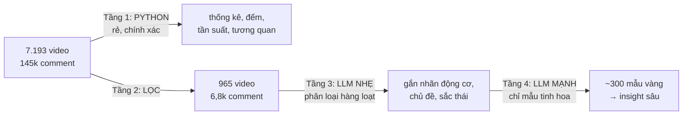

# LOGIC CHỌN LỌC — "Phân tích có chọn lọc, không quét hết"

> Tài liệu này định nghĩa **chính xác** cái gì được đưa vào phân tích và **vì sao**.
>
> **Đây là tài liệu KHUNG CHUNG.** Ngưỡng là mặc định cho mọi ngách.
> Ngách nào cần ngưỡng khác → ghi vào `NICHE_BRIEF.md` kèm **lý do**, không sửa file này.
>
> Các con số minh họa lấy từ ngách `christian-blues` (53 kênh · 7.193 video · 145.150 comment),
> đã chạy thử trên dữ liệu thật.
>
> Phiên bản: v1.0 · Cập nhật 2026-08-15 · logic lọc 4 rổ

---

## 1. VÌ SAO PHẢI CHỌN LỌC

| Lý do | Giải thích |
|---|---|
| **Chi phí** | 145.150 comment nếu đưa hết vào LLM ≈ 15-20 triệu token cho một lần phân tích |
| **Nhiễu át tín hiệu** | 60% comment là "Amen 🙏", "Beautiful ❤️" — lặp lại, không mang thông tin |
| **Đuôi dài đánh lừa** | 7.193 video nhưng view trung vị chỉ 1.204 → phần lớn là video không ai xem |
| **Chất lượng > số lượng** | 500 comment sâu cho insight tốt hơn 145.000 comment trộn lẫn |

> **Nguyên tắc:** không lấy mẫu ngẫu nhiên thuần túy. Lấy mẫu **có chủ đích theo tín hiệu**, cộng thêm một phần ngẫu nhiên để chống thiên lệch.

---

## 2. CHỈ SỐ NỀN (tính trước khi lọc)

```python
age_days      = (crawl_date - published_at).days          # tối thiểu 1
vpd           = view_count / age_days                      # view mỗi ngày
channel_median= median(view_count) theo từng kênh
outlier_ratio = view_count / channel_median                # bội số so với chính kênh đó
engagement    = (like + comment) / view_count
```

**Vì sao dùng `outlier_ratio` thay vì `view_count` thuần:**
Một video 50.000 view trên kênh trung vị 40.000 là **bình thường**.
Một video 50.000 view trên kênh trung vị 500 là **bùng nổ (100×)**.
Chuẩn hóa theo chính kênh đó loại bỏ ảnh hưởng "kênh to nên video nào cũng nhiều view".

**Vì sao dùng `vpd` thay vì `view_count`:**
Video đăng 500 ngày trước và video đăng 30 ngày trước không thể so trực tiếp. `vpd` đưa về cùng mặt bằng.

---

## 3. BỘ LỌC VIDEO: 7.193 → 965 (13,4%)

### 4 rổ, hợp nhất, khử trùng lặp

Cột "ví dụ" là kết quả khi chạy trên `christian-blues`. Ngách khác sẽ ra số khác — điều
cần giữ là **tỷ lệ mục tiêu 10–15% tổng video**. Nếu lệch nhiều, chỉnh ngưỡng theo §9.

| Rổ | Điều kiện | Ví dụ | Mục đích |
|---|---|---|---|
| **B1 · Outlier** | `is_matured` **và** `outlier_ratio ≥ 5` **và** `view ≥ 20.000` | **435** | Giải mã công thức thắng |
| **B2 · Đang lên** | `age ≤ 90 ngày` **và** `vpd ≥ P90` | **366** | Bắt trend mới, chống dữ liệu cũ |
| **B3 · Đại diện** | Top 5 view **mỗi kênh** | **264** | Đảm bảo phủ đủ 53/53 kênh |
| **B4 · Đối chứng** | `is_matured` **và** `outlier_ratio ≤ 0.2` **và** `view ≥ 500` | **161** | Học từ cái KHÔNG hiệu quả |
| | **HỢP NHẤT (khử trùng)** | **965** | |

> ⚠️ **`is_matured` là điều kiện BẮT BUỘC của B1 và B4, đừng bỏ sót.**
> `is_matured = age_days ≥ 60` (đặt trong `enrich.py`). Video dưới 60 ngày còn
> đang được đẩy, view chưa ổn định — so nó với video cũ là so sai.
> Chỉ **5.609/7.193** video đạt điều kiện này.
>
> Bỏ qua `is_matured` khi tái tạo cho ra **B1=496 · B4=132** thay vì **435 · 161** —
> lệch hai chiều 74/60 dòng. Đây chính là bài học **A16**: nhãn rổ phải **đọc từ
> cột `bucket` trong `selected_videos.parquet`**, không tái tạo lại từ ngưỡng.
>
> Một điểm nữa dễ sai: `outlier_ratio = view ÷ channel_median_view`, trong đó
> `channel_median_view` là trung vị của **video đã chín** thuộc kênh đó, không
> phải trung vị của mọi video. Cả hai đều tính sẵn trong `enrich.py`.
>
> Và `P90` của B2 là **phân vị 90 có nội suy tuyến tính** (`pandas.quantile`),
> bằng **174,7194** cho ngách này. Lấy phần tử ở chỉ số nguyên cho ra 174,6700
> và rổ B2 lệch vài video.

### Vì sao mỗi rổ tồn tại

**B1 — Outlier.** Đây là nơi có tín hiệu mạnh nhất. Ngưỡng `≥5×` đảm bảo không phải dao động ngẫu nhiên. Ngưỡng `view ≥ 20.000` loại bỏ trường hợp giả: kênh trung vị 10 view có video 100 view = "10×" nhưng vô nghĩa.

**B2 — Đang lên.** Nếu chỉ lấy outlier lịch sử, ta học được công thức của **quá khứ**. Rổ này bắt cái đang chạy *ngay bây giờ*. Đây là điểm sửa lỗi P3 (script cũ chỉ copy cái đang win).

**B3 — Đại diện.** B1 và B2 thiên về kênh lớn. Rổ này ép mỗi kênh — kể cả kênh nhỏ — đóng góp 5 video tốt nhất, để bản đồ đối thủ không bị khuyết.

**B4 — Đối chứng (quan trọng nhất, thường bị bỏ quên).**
Cả script Internet lẫn bảng FMG chỉ nhìn cái thắng → mắc **survivorship bias**.
Không có nhóm đối chứng thì không thể nói "title dài thắng" — có thể video thua *cũng* có title dài.
Rổ này lấy video **thất bại trên chính kênh đang mạnh** → biến quan sát thành so sánh có kiểm soát.

> **Đây là nâng cấp phương pháp luận lớn nhất so với cách làm cũ.**

### Nguồn sự thật của công thức

Tài liệu này mô tả **ý định**; mã nguồn mới là thứ chạy thật. Khi hai bên lệch
nhau, tin mã nguồn và sửa tài liệu:

| Muốn biết | Đọc file |
|---|---|
| Bốn rổ lọc thế nào | `pipeline/transform/apply_filters.py` — 4 dòng, đọc thẳng được |
| `outlier_ratio`, `is_matured`, `vpd` tính ra sao | `pipeline/transform/enrich.py` dòng 49–70 |
| Ngưỡng đang dùng cho ngách này | `niches/*/00_input/processed/_selection_params.json` |
| Video nào thuộc rổ nào | cột `bucket` trong `selected_videos.parquet` — **đọc cột này, đừng tính lại** |

Bản mô phỏng `_web/chuan-hoa.html` cũng tái hiện đúng bốn công thức trên và cho
kéo ngưỡng để xem số đổi. Ở ngưỡng mặc định nó ra đúng **435 · 366 · 264 · 161 ·
hợp nhất 965**, đã đối chiếu khớp từng nhãn với `selected_videos.parquet`.

---

## 4. BỘ LỌC COMMENT: 145.150 → 5.325 (3.7%)

| Tầng | Điều kiện | Số lượng thực tế | Mục đích |
|---|---|---|---|
| **C1 · Cộng đồng bình chọn** | `like_count ≥ 25` | 1.535 | Ý kiến được số đông xác nhận |
| **C2 · Chiều sâu** | `len ≥ 200` ký tự **và** `like ≥ 2` | 4.159 | Chứa câu chuyện + lý do |
| | **HỢP NHẤT** | **5.325** | |
| **C3 · Mẫu ngẫu nhiên** | random 1.500 từ video B1+B2 | +1.500 | Chống thiên lệch |
| | **TỔNG PHÂN TÍCH** | **~6.800** | |

### Loại bỏ trước khi lọc
- `len < 15` ký tự (chỉ emoji / "Amen")
- Trùng lặp văn bản chính xác (spam)
- Comment chỉ chứa link
- Reply rỗng nghĩa ("❤️", "👍")

### Vì sao ngưỡng này đúng

**C1 (like ≥ 25):** Like trên comment là **phiếu bầu của khán giả**. Comment 1.444 like *"Finally something for those of us who love the music but can't stand the lyrics of the blues"* không phải ý kiến một người — nó là **1.444 người đồng thanh**. Đây là dữ liệu đại diện mạnh hơn bất cứ khảo sát nào.

**C2 (len ≥ 200 + like ≥ 2):** Comment dài chứa **"vì sao"**. Người viết 200 ký tự đang kể câu chuyện, không chỉ phản ứng. Thêm `like ≥ 2` để loại bỏ văn bản dài nhưng là spam.

**C3 (ngẫu nhiên):** C1 và C2 thiên về người nói to và người viết dài. Mẫu ngẫu nhiên đảm bảo bắt được cả người bình luận ngắn gọn nhưng chân thực.

---

## 5. PHÂN TẦNG XỬ LÝ (tiết kiệm chi phí)

Không phải mọi thứ đều cần model mạnh:



| Tầng | Công cụ | Xử lý gì | Vì sao |
|---|---|---|---|
| 1 | Python/pandas | Toàn bộ 100% dữ liệu | Thống kê không cần AI — nhanh, chính xác, miễn phí |
| 2 | Quy tắc lọc | 7.193 → 965 | Đã mô tả ở trên |
| 3 | LLM nhẹ (Haiku) | 6.800 comment | Phân loại hàng loạt, chi phí thấp |
| 4 | LLM mạnh (Opus) | ~300 mẫu tinh hoa | Tổng hợp insight, viết persona |

> **Điểm mấu chốt:** thống kê mô tả (tần suất tag, phân bố view, tương quan) **không bao giờ** cần LLM. Chỉ dùng LLM cho việc *hiểu ngôn ngữ* — phân loại động cơ, trích nỗi đau, tổng hợp chân dung.

---

## 6. QUY TẮC CHỐNG THIÊN LỆCH

| Thiên lệch | Biểu hiện | Cách chống |
|---|---|---|
| **Survivorship** | Chỉ học từ video thắng | Rổ B4 — nhóm đối chứng |
| **Recency** | Chỉ nhìn video mới | B1 lấy cả lịch sử, B2 lấy mới → cân bằng |
| **Kênh lớn áp đảo** | Top kênh chiếm hết mẫu | B3 ép mỗi kênh 5 video |
| **Người nói to** | Chỉ nghe comment dài/nhiều like | C3 — mẫu ngẫu nhiên |
| **Xác nhận giả thuyết** | Chỉ tìm cái mình muốn thấy | Ghi giả thuyết TRƯỚC khi chạy; báo cáo cả bằng chứng phản bác |
| **Suy diễn nhân khẩu** | Đoán tuổi/sắc tộc từ tên | **Chỉ ghi nhận khi người dùng tự khai** |

---

## 7. KIỂM CHỨNG BỘ LỌC

Sau khi lọc, phải xác nhận:

| Kiểm tra | Tiêu chí đạt |
|---|---|
| Phủ kênh | 965 video phải trải đủ **53/53 kênh** |
| Phủ thời gian | Có video ở mọi tháng từ 2025-06 → 2026-08 |
| Phủ định dạng | Cả 6 `duration_band` đều có mặt |
| Có nhóm đối chứng | B4 ≥ 100 video |
| Tổng view đại diện | 965 video phải chiếm **≥ 70% tổng view ngách** |

> Kiểm tra cuối quan trọng nhất: nếu 13% video nắm ≥70% view, ta đã bắt đúng phần thị trường **thực sự có người xem**.

---

## 8. ĐẠO ĐỨC & TUÂN THỦ

| Nguyên tắc | Thực hiện |
|---|---|
| Danh tính người bình luận | `author_hash` là SHA-256 có salt — **không cố truy ngược** |
| Thuộc tính nhân khẩu | Chỉ ghi khi **tự khai công khai**; không suy đoán từ tên |
| Trích dẫn | Dùng để hiểu nhu cầu thị trường, không nhắm vào cá nhân |
| Điều khoản YouTube API | Làm mới hoặc xóa dữ liệu trong **30 ngày** (README ghi rõ) |
| Lưu trữ | Dữ liệu thô giữ nội bộ, báo cáo chỉ chứa trích dẫn tổng hợp |


---

## 9. HIỆU CHỈNH NGƯỠNG CHO NGÁCH MỚI

Ngưỡng mặc định được chỉnh cho ngách cỡ **5.000–10.000 video**. Ngách khác cỡ phải chỉnh.

### Quy trình chỉnh

```
1. Chạy bộ lọc với ngưỡng mặc định
2. Đo tỷ lệ thực tế
3. So với mục tiêu:  video 10–15%  ·  comment 4–6%
4. Lệch  → chỉnh theo bảng dưới → chạy lại
5. Ghi ngưỡng cuối + lý do vào NICHE_BRIEF.md
```

### Bảng chỉnh

| Triệu chứng | Chỉnh |
|---|---|
| Lọt quá nhiều video (> 20%) | Tăng `outlier_ratio` (5 → 7), tăng ngưỡng view |
| Lọt quá ít video (< 8%) | Giảm `outlier_ratio` (5 → 3), giảm ngưỡng view |
| Rổ B4 dưới 100 video | Nới `outlier_ratio ≤ 0.2` thành `≤ 0.35` |
| Comment lọt quá ít | Giảm `like ≥ 25` → `≥ 10`; `len ≥ 200` → `≥ 120` |
| Ngách nhỏ (< 1.000 video) | Bỏ lọc, phân tích toàn bộ |

### Ngưỡng theo cỡ ngách

| Cỡ ngách | B1 outlier | B1 view tối thiểu | C1 like | C2 độ dài |
|---|---|---|---|---|
| < 1.000 video | — bỏ lọc — | — | ≥ 5 | ≥ 80 |
| 1.000–5.000 | ≥ 3 | ≥ 5.000 | ≥ 10 | ≥ 120 |
| **5.000–10.000** | **≥ 5** | **≥ 20.000** | **≥ 25** | **≥ 200** |
| > 10.000 | ≥ 8 | ≥ 50.000 | ≥ 50 | ≥ 250 |

> **Nguyên tắc:** ngưỡng thay đổi, nhưng **cấu trúc 4 rổ + 3 tầng không đổi**.
> Đặc biệt rổ B4 (đối chứng) không bao giờ được bỏ — đó là thứ giữ cho kết luận có giá trị.
