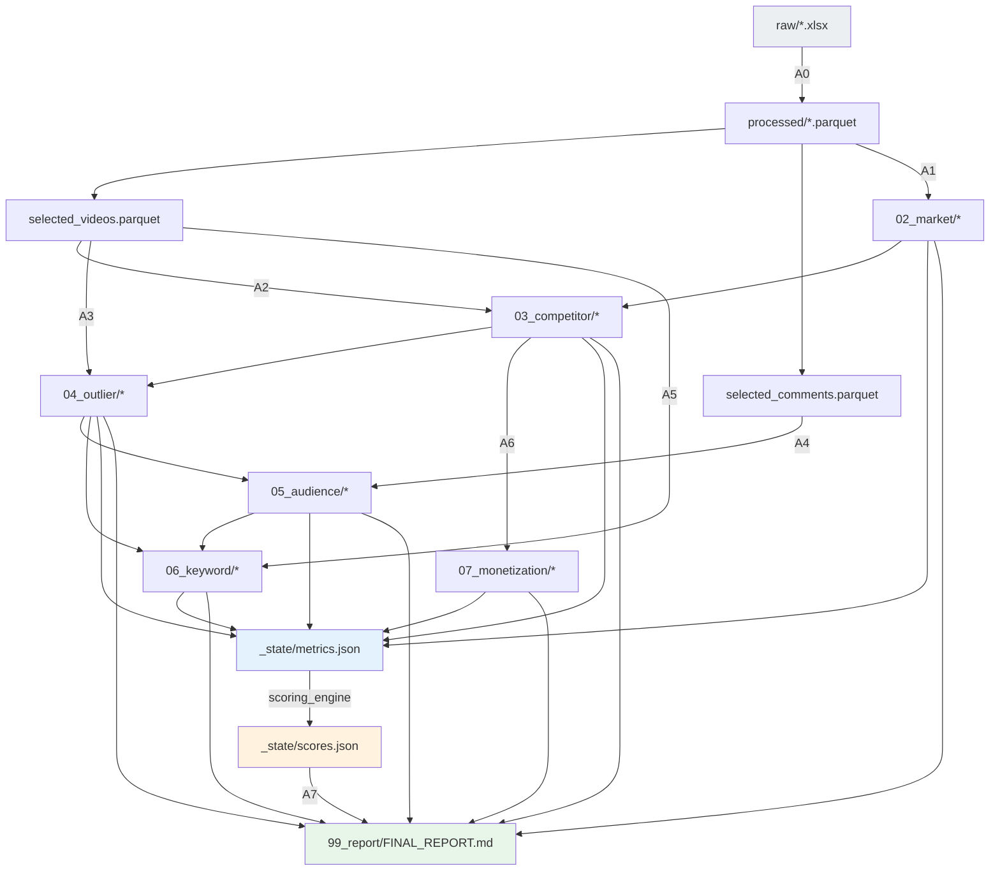

# HỢP ĐỒNG FILE — Ai đọc gì, ghi gì

> Đây là **giao kèo bắt buộc**. Agent chỉ được đọc/ghi đúng những gì khai báo ở đây.
> Nếu cần file không có trong hợp đồng → phải cập nhật tài liệu này trước, không tự ý đọc.
>
> Lý do: bước sau phải biết chắc bước trước để lại gì và ở đâu. Không có hợp đồng thì
> mỗi lần chạy lại là một lần đoán.

---

## 1. QUY ƯỚC ĐƯỜNG DẪN

Trong toàn bộ tài liệu:
- `<N>` = thư mục ngách, ví dụ `niches/christian-blues`
- `<FW>` = `framework`
- Đường dẫn tương đối tính từ gốc dự án

---

## 2. BẢNG HỢP ĐỒNG TỔNG

| Agent | Step | ĐỌC | GHI |
|---|---|---|---|
| **A0** | 01 | `<N>/00_input/raw/*` | `<N>/00_input/processed/*.parquet`<br>`<N>/00_input/processed/DATA_QUALITY.md` |
| **A1** | 02 | `processed/channels.parquet`<br>`processed/videos.parquet` | `<N>/02_market/01_market_sizing.md`<br>`<N>/02_market/02_momentum.md`<br>`metrics.json → market.*`, `momentum.*` |
| **A2** | 03 | `processed/channels.parquet`<br>`processed/selected_videos.parquet`<br>`<N>/02_market/*` | `<N>/03_competitor/01_channel_map.md`<br>`<N>/03_competitor/02_channel_table.csv`<br>`metrics.json → entry.*`, `ai_fit.*` |
| **A3** | 04 | `processed/selected_videos.parquet`<br>`processed/thumbnails.parquet`<br>`<N>/03_competitor/*` | `<N>/04_outlier/01_winning_formula.md`<br>`<N>/04_outlier/02_outlier_table.csv`<br>`<N>/04_outlier/03_control_group.csv` |
| **A4** | 05 | `processed/selected_comments.parquet`<br>`<N>/04_outlier/01_winning_formula.md`<br>`<N>/03_competitor/01_channel_map.md` | `<N>/05_audience/01_personas.md`<br>`<N>/05_audience/02_voice_of_customer.md`<br>`<N>/05_audience/03_quote_bank.csv` |
| **A5** | 06 | `processed/selected_videos.parquet`<br>`<N>/04_outlier/01_winning_formula.md`<br>`<N>/05_audience/02_voice_of_customer.md` | `<N>/06_keyword/01_keyword_map.md`<br>`<N>/06_keyword/02_keyword_scores.csv`<br>`<N>/06_keyword/03_title_patterns.md` |
| **A6** | 07 | `processed/channels.parquet`<br>`<N>/03_competitor/01_channel_map.md`<br>`<FW>/04_reference/rpm_benchmarks.md` | `<N>/07_monetization/01_revenue_model.md`<br>`<N>/07_monetization/02_risk_register.md`<br>`metrics.json → money.*`, `risk.*` |
| **A7** | 08 | **tất cả** output trên<br>`_state/scores.json` | `<N>/99_report/FINAL_REPORT.md`<br>`<N>/99_report/EXEC_SUMMARY.md` |
| **scoring_engine** | 08 | `_state/metrics.json`<br>`<FW>/00_system/03_SCORING_RUBRIC.md` | `_state/scores.json` |

---

## 3. QUY TẮC GHI

| # | Quy tắc |
|---|---|
| W1 | **Chỉ ghi file mình sở hữu.** Không agent nào sửa output của agent khác. |
| W2 | **`metrics.json` là thêm, không đè.** Mỗi agent chỉ chạm namespace của mình. |
| W3 | **`scores.json` chỉ `scoring_engine` được ghi.** Thực thi quy tắc R2. |
| W4 | **`raw/` không bao giờ bị ghi.** Chỉ đọc. |
| W5 | **Mọi file `.md` output phải có header chuẩn** (§5). |
| W6 | **Cập nhật `PROGRESS.md`** sau khi ghi xong output. |

---

## 4. NAMESPACE TRONG `metrics.json`

Mỗi agent chỉ được ghi vào namespace của mình:

```
market.*      → A1     momentum.*   → A1
entry.*       → A2     ai_fit.*     → A2
formula.*     → A3     audience.*   → A4
keyword.*     → A5     money.*      → A6
risk.*        → A6     _meta.*      → tất cả (bắt buộc)
```

### Ví dụ ghi đúng

```json
{
  "niche": "christian-blues",
  "rubric_version": "1.0",
  "momentum": {
    "M2_1_view_growth": 1.18,
    "M2_2_supply_growth": 3.37,
    "M2_4_demand_supply_gap": 0.35
  },
  "_meta": {
    "M2_4_demand_supply_gap": {
      "formula": "M2_1 / M2_2",
      "source": "processed/videos.parquet",
      "computed_by": "A1",
      "computed_at": "2026-08-15",
      "confidence": "medium",
      "caveat": "video_stats chỉ 1 snapshot; suy từ published_at",
      "counter_evidence": "kênh mới goldensoulworship vẫn đạt 3.05tr/2.8 tháng"
    }
  }
}
```

**Trường `_meta` bắt buộc cho mọi metric.** Thiếu `_meta` → `scoring_engine` từ chối chấm.
Trường `counter_evidence` bắt buộc khi `confidence` ≠ `high` — thực thi quy tắc D6.

---

## 5. HEADER CHUẨN CHO FILE OUTPUT `.md`

Mọi file output phải mở đầu bằng khối này:

```markdown
---
step: STEP_04
agent: A3 · Outlier Miner
niche: christian-blues
generated: 2026-08-15
inputs:
  - 00_input/processed/selected_videos.parquet
  - 03_competitor/01_channel_map.md
confidence: high
open_questions:
  - Chưa kiểm được thumbnail cluster có ý nghĩa nhân quả không
---
```

Lý do: agent sau đọc header là biết ngay **dữ liệu này đáng tin tới đâu** và **còn gì chưa chắc**.

---

## 6. SƠ ĐỒ PHỤ THUỘC FILE



**Đọc sơ đồ này để biết:** nếu sửa một file, những file nào phải chạy lại.
Ví dụ: sửa bộ lọc trong A0 → `selected_videos.parquet` đổi → A2, A3, A5 phải chạy lại → kéo theo A4, A6, A7.

---

## 7. FILE CẤU HÌNH NGÁCH

### `<N>/NICHE_BRIEF.md` — mọi agent đều đọc

Chứa những gì **riêng của ngách**, để `framework/` không cần biết:

| Trường | Ví dụ (Christian Blues) |
|---|---|
| Tên ngách | Christian Blues / Gospel Blues |
| Thị trường mục tiêu | Mỹ (Tier-1), mở rộng LatAm |
| Ngôn ngữ chính | en-US |
| Ngày crawl | 2026-08-13 |
| Quy mô dữ liệu | 53 kênh · 7.193 video · 145.150 comment |
| Giả thuyết ban đầu | Ngách trẻ, cầu tăng, cửa còn mở |
| Ngưỡng tùy chỉnh | (nếu khác mặc định — phải ghi lý do) |

### `<N>/PROGRESS.md` — bộ nhớ chung

Xem định dạng ở `01_ARCHITECTURE.md` §7.1.

---

## 8. XỬ LÝ KHI HỢP ĐỒNG BỊ VI PHẠM

| Tình huống | Xử lý |
|---|---|
| Agent cần file không có trong hợp đồng | **Dừng.** Cập nhật tài liệu này, ghi lý do, rồi mới đọc |
| File đầu vào chưa tồn tại | **Dừng.** Ghi vào `PROGRESS.md` là bị chặn, nêu rõ thiếu gì |
| Metric thiếu `_meta` | `scoring_engine` từ chối chấm, báo lỗi rõ metric nào |
| Hai agent cùng ghi một namespace | Lỗi thiết kế — sửa `01_agents/`, không vá tạm |
