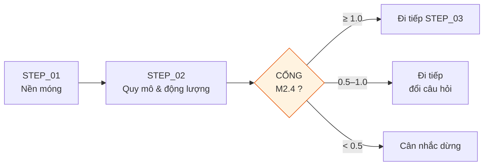

# STEP_01 · NỀN MÓNG  (+ gộp STEP_02)

| | |
|---|---|
| **Agent** | A0 · Data Engineer |
| **Đầu vào** | `00_input/raw/*` |
| **Đầu ra** | 6 file parquet · `DATA_QUALITY.md` |

---

## ⭐ KHUYẾN NGHỊ: GỘP VỚI STEP_02

**Nên chạy STEP_01 + STEP_02 liền nhau thành một lượt.**

Lý do: STEP_02 chứa **cổng quyết định** — nó trả lời *ngách này còn đáng vào không?*
Nếu câu trả lời là không, ta dừng ngay và tiết kiệm 6 bước sau.

Chạy gộp = **một lần đọc dữ liệu**, tránh nạp lại parquet hai lần.

---

## QUY TRÌNH

### 1 · Chuẩn hóa
Đọc `raw/` → parquet. Ép kiểu, chuẩn timezone UTC, đổi tên cột về schema chuẩn.

### 2 · Kiểm toán chất lượng
7 kiểm tra ở `02_DATA_MODEL.md` §5 → ghi `DATA_QUALITY.md`.
> ⚠️ Không bỏ qua bước này. Cột thiếu > 30% mà vẫn dùng làm kết luận chính là lỗi nặng.

### 3 · Làm giàu
8 cột ở `02_DATA_MODEL.md` §3.
**Quan trọng nhất:** `is_matured = age_days ≥ 60`.

### 4 · Lọc chọn lọc
4 rổ video + 3 tầng comment. Đo tỷ lệ, so mục tiêu (video 10–15%, comment 4–6%).
Lệch → chỉnh theo §9 → ghi ngưỡng cuối vào `NICHE_BRIEF.md`.

### 5 · Kiểm chứng
| Kiểm tra | Đạt |
|---|---|
| Phủ kênh | 100% |
| Phủ thời gian | mọi tháng có dữ liệu |
| Phủ định dạng | mọi `duration_band` |
| Rổ đối chứng | ≥ 100 video |
| **Phủ view** | **≥ 70% tổng view ngách** |

---

## TIÊU CHÍ XONG
- [ ] 6 parquet đọc được
- [ ] `DATA_QUALITY.md` đủ 7 kiểm tra
- [ ] Tỷ lệ lọc trong khoảng mục tiêu
- [ ] 5 kiểm chứng đều đạt
- [ ] `PROGRESS.md` cập nhật

## BẪY THƯỜNG GẶP
| Bẫy | Hậu quả | Cách tránh |
|---|---|---|
| Tính outlier trên video mới đăng | Ảo giác "ngách đang sụp" | Chỉ dùng `is_matured` |
| Quên khử trùng `video_id` | Đếm sai | Kiểm tra ở bước 2 |
| Timezone lẫn lộn | Sai tháng | Ép UTC ngay khi đọc |
| Bỏ qua kiểm tra phủ view | Phân tích nhầm phần thị trường không ai xem | Bắt buộc chạy |
