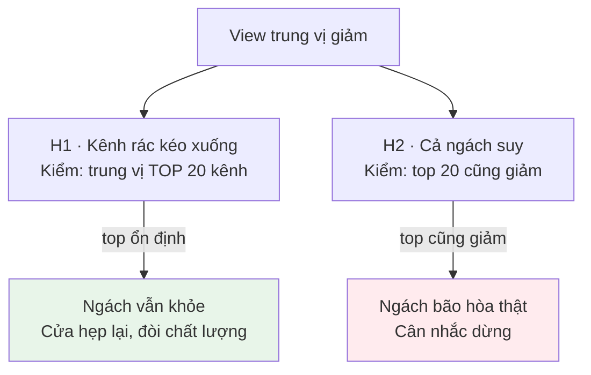

# STEP_02 · QUY MÔ & ĐỘNG LƯỢNG

| | |
|---|---|
| **Agent** | A1 · Market Analyst |
| **Đầu vào** | `processed/channels.parquet` · `processed/videos.parquet` |
| **Đầu ra** | `02_market/01_market_sizing.md` · `02_market/02_momentum.md` |
| **Trục** | T1 · T2 |

> 💡 Nên chạy gộp với STEP_01 — xem `STEP_01_foundation.md`.

---

## ĐÂY LÀ BƯỚC CÓ CỔNG QUYẾT ĐỊNH

Bước này quyết định có chạy tiếp 6 bước sau hay không. Làm kỹ.

---

## QUY TRÌNH

### 1 · Quy mô (T1)
`M1.1` view/tháng · `M1.2` số kênh hoạt động · `M1.3` **trung vị** view/video

### 2 · Động lượng (T2)
```
M2.1 = view 3 tháng gần / 3 tháng trước
M2.2 = video mới 3 tháng gần / 3 tháng trước
M2.3 = % kênh < 12 tháng
M2.4 = M2.1 / M2.2          ← quyết định
```

### 3 · Kiểm tra pha loãng — BẮT BUỘC

Vẽ view trung vị theo tháng đăng, **chỉ dùng `is_matured = True`**.

Nếu trung vị giảm → **bắt buộc tách hai giả thuyết:**



> **Không tách được H1/H2 thì không được kết luận về bão hòa.**
> Đây là lỗi phổ biến nhất: thấy trung vị giảm liền kết luận thị trường chết,
> trong khi thật ra chỉ là nhiều kênh mới đăng video kém.

### 4 · Địa lý & ngôn ngữ
Phân bố quốc gia, ngôn ngữ → thị trường lõi + nhánh mở rộng.

---

## CỔNG QUYẾT ĐỊNH — GHI RÕ TRONG OUTPUT

| M2.4 | Khuyến nghị | Câu hỏi cho các bước sau |
|---|---|---|
| ≥ 1.0 | ✅ Đi tiếp | "Vào bằng cách nào?" |
| 0.5 – 1.0 | ⚠️ Đi tiếp, thận trọng | "Khác biệt bằng gì để không bị pha loãng?" |
| < 0.5 **và** H2 đúng | 🛑 Dừng | — |
| < 0.5 **nhưng** H1 đúng | ⚠️ Đi tiếp | "Làm sao lọt vào nhóm chất lượng cao?" |

---

## TIÊU CHÍ XONG
- [ ] Đủ M1.1–1.3, M2.1–2.4, có `_meta`
- [ ] **Đã tách H1 vs H2**, kết luận rõ
- [ ] Có biểu đồ trung vị theo tháng (chỉ `is_matured`)
- [ ] Có khuyến nghị cổng quyết định
- [ ] Ghi độ tin cậy (1 snapshot → tối đa "vừa")
- [ ] Có mục bằng chứng phản bác (quy tắc D6)
